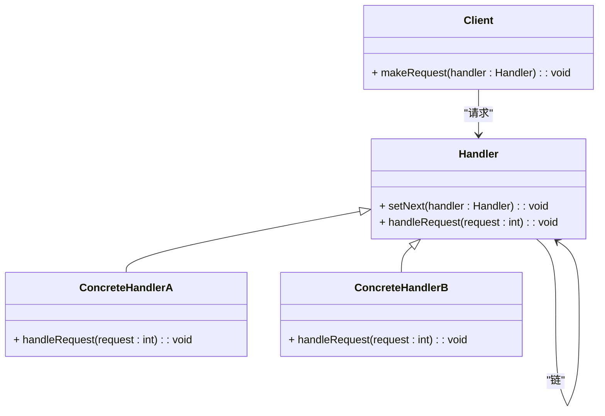

### 责任链模式（Chain of Responsibility）

责任链模式是一种行为型设计模式，旨在避免请求发送者和接收者之间的紧耦合关系。它通过将请求沿着一系列处理对象传递的方式，使得多个对象有机会处理请求。责任链模式的核心思想是将请求的处理分散到多个对象上，每个对象只处理自己能力范围内的请求，并将处理未完成的请求传递给链中的下一个对象。

#### 1. 责任链模式的结构
责任链模式包含以下几个主要组件：
- **Handler（处理者接口）**: 定义了处理请求的接口，并声明了设置下一个处理者的方法。
- **ConcreteHandler（具体处理者）**: 实现了 `Handler` 接口，负责处理请求或者将请求传递给下一个处理者。
- **Client（客户端）**: 向链中的第一个处理者发送请求。

#### 2. Mermaid 关系图
以下是责任链模式的类图，用 Mermaid 表示：



#### 3. 责任链模式的实现

**Handler 处理者接口：**
```cpp
class Handler {
protected:
    Handler* nextHandler;

public:
    Handler() : nextHandler(nullptr) {}
    virtual ~Handler() = default;

    void setNext(Handler* handler) {
        nextHandler = handler;
    }

    virtual void handleRequest(int request) const = 0;
};
```

**ConcreteHandlerA 具体处理者A：**
```cpp
class ConcreteHandlerA : public Handler {
public:
    void handleRequest(int request) const override {
        if (request >= 0 && request < 10) {
            std::cout << "ConcreteHandlerA handles request " << request << "\n";
        } else if (nextHandler) {
            nextHandler->handleRequest(request);
        }
    }
};
```

**ConcreteHandlerB 具体处理者B：**
```cpp
class ConcreteHandlerB : public Handler {
public:
    void handleRequest(int request) const override {
        if (request >= 10 && request < 20) {
            std::cout << "ConcreteHandlerB handles request " << request << "\n";
        } else if (nextHandler) {
            nextHandler->handleRequest(request);
        }
    }
};
```

**Client 客户端代码：**
```cpp
int main() {
    Handler* handlerA = new ConcreteHandlerA();
    Handler* handlerB = new ConcreteHandlerB();

    handlerA->setNext(handlerB);

    handlerA->handleRequest(5);    // Handled by ConcreteHandlerA
    handlerA->handleRequest(15);   // Handled by ConcreteHandlerB
    handlerA->handleRequest(25);   // No handler in the chain

    delete handlerB;
    delete handlerA;
    return 0;
}
```

#### 4. 使用责任链模式
在客户端代码中，构造一个处理链，并设置每个处理者的下一个处理者。客户端将请求发送到链的起始点，链中的每个处理者依次处理请求，直到请求被处理或到达链的末端。

#### 5. 总结
责任链模式通过将请求沿着处理链传递，使得多个对象有机会处理请求，从而减少了请求发送者和接收者之间的紧耦合关系。Mermaid 类图展示了处理者接口、具体处理者类以及它们之间的关系，帮助理解模式的结构和实现。
