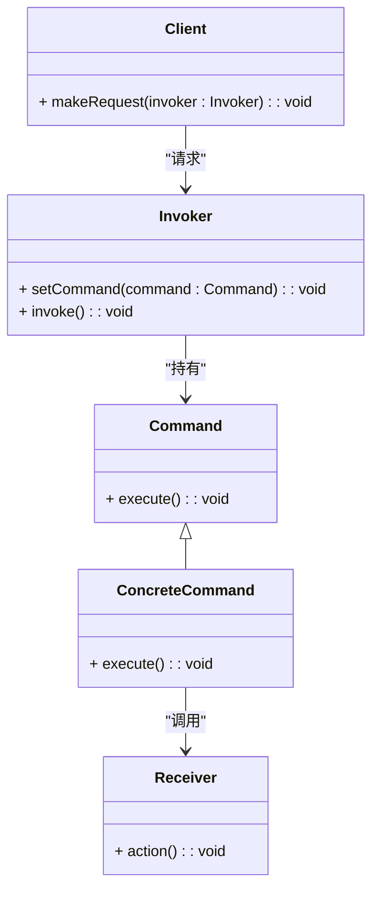

### 命令模式（Command）

命令模式是一种行为型设计模式，用于将请求封装为对象，从而使得可以使用不同的请求、排队请求、以及支持撤销操作。命令模式通过将请求的发起者与请求的执行者解耦来提供更大的灵活性。

#### 1. 命令模式的结构
命令模式包含以下几个主要组件：
- **Command（命令接口）**: 定义了执行请求的接口。
- **ConcreteCommand（具体命令）**: 实现了 `Command` 接口，并定义了请求的具体操作。
- **Receiver（接收者）**: 负责实际执行请求的操作。
- **Invoker（调用者）**: 请求执行者，持有命令对象，并在适当的时候调用命令的 `execute` 方法。
- **Client（客户端）**: 创建一个具体的命令对象并将其传递给调用者。

#### 2. Mermaid 关系图
以下是命令模式的类图，用 Mermaid 表示：



#### 3. 命令模式的实现

**Command 命令接口：**
```cpp
class Command {
public:
    virtual ~Command() = default;
    virtual void execute() const = 0;
};
```

**ConcreteCommand 具体命令类：**
```cpp
class Receiver {
public:
    void action() const {
        std::cout << "Receiver action\n";
    }
};

class ConcreteCommand : public Command {
private:
    Receiver* receiver;

public:
    ConcreteCommand(Receiver* r) : receiver(r) {}

    void execute() const override {
        receiver->action();
    }
};
```

**Invoker 调用者：**
```cpp
class Invoker {
private:
    Command* command;

public:
    void setCommand(Command* cmd) {
        command = cmd;
    }

    void invoke() const {
        if (command) {
            command->execute();
        }
    }
};
```

**Client 客户端代码：**
```cpp
int main() {
    Receiver receiver;
    Command* command = new ConcreteCommand(&receiver);
    Invoker invoker;

    invoker.setCommand(command);
    invoker.invoke();

    delete command;
    return 0;
}
```

#### 4. 使用命令模式
在客户端代码中，创建具体的命令对象，并将其传递给调用者。调用者在适当的时间调用命令的 `execute` 方法，从而触发实际的操作。命令模式允许将请求的发起者与请求的执行者解耦，使得请求可以被灵活地处理和管理。

#### 5. 总结
命令模式通过将请求封装为对象来提供更大的灵活性，使得可以使用不同的请求、排队请求、以及支持撤销操作。Mermaid 类图展示了命令接口、具体命令类、接收者、调用者以及它们之间的关系，帮助理解模式的结构和实现。