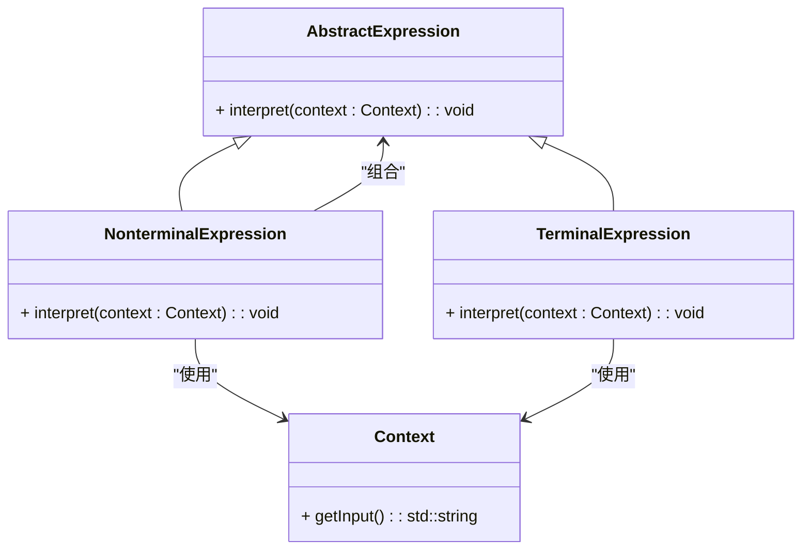

### 解释器模式（Interpreter）

解释器模式是一种行为型设计模式，主要用于定义一种语言的语法，并提供一个解释器来解释该语言中的句子。解释器模式通常用于实现简单语言的解析和解释，如表达式解析和语法分析。它将问题的解法逐步分解为简单的部分，并对每部分提供相应的解释和处理。

#### 1. 解释器模式的结构
解释器模式包含以下几个主要组件：
- **AbstractExpression（抽象表达式）**: 定义了解释方法和文法规则的接口。
- **TerminalExpression（终结符表达式）**: 实现了文法中的终结符表达式，并定义了解释这些终结符的方法。
- **NonterminalExpression（非终结符表达式）**: 实现了文法中的非终结符表达式，并定义了解释这些非终结符的方法。它通常由多个终结符表达式组合而成。
- **Context（上下文）**: 包含解释所需的输入信息。

#### 2. Mermaid 关系图
以下是解释器模式的类图，用 Mermaid 表示：



#### 3. 解释器模式的实现

**AbstractExpression 抽象表达式：**
```cpp
class Context {
private:
    std::string input;

public:
    Context(const std::string& in) : input(in) {}
    std::string getInput() const { return input; }
};

class AbstractExpression {
public:
    virtual ~AbstractExpression() = default;
    virtual void interpret(const Context& context) const = 0;
};
```

**TerminalExpression 终结符表达式：**
```cpp
class TerminalExpression : public AbstractExpression {
public:
    void interpret(const Context& context) const override {
        std::cout << "TerminalExpression interpreting: " << context.getInput() << "\n";
    }
};
```

**NonterminalExpression 非终结符表达式：**
```cpp
class NonterminalExpression : public AbstractExpression {
private:
    AbstractExpression* expr1;
    AbstractExpression* expr2;

public:
    NonterminalExpression(AbstractExpression* e1, AbstractExpression* e2) : expr1(e1), expr2(e2) {}
    
    void interpret(const Context& context) const override {
        std::cout << "NonterminalExpression interpreting\n";
        expr1->interpret(context);
        expr2->interpret(context);
    }
};
```

**Client 客户端代码：**
```cpp
int main() {
    Context context("Sample Input");
    
    AbstractExpression* expr1 = new TerminalExpression();
    AbstractExpression* expr2 = new TerminalExpression();
    AbstractExpression* nonTerminalExpr = new NonterminalExpression(expr1, expr2);
    
    nonTerminalExpr->interpret(context);

    delete nonTerminalExpr;
    delete expr2;
    delete expr1;
    return 0;
}
```

#### 4. 使用解释器模式
在客户端代码中，构造解释器对象并将其应用于上下文。解释器将输入的上下文传递给终结符和非终结符表达式，根据语法规则对输入进行解释。

#### 5. 总结
解释器模式通过定义一种语言的文法规则和解释器来解析和解释语言中的句子。它将复杂的解析任务分解为简单的部分，通过终结符和非终结符表达式来处理输入。Mermaid 类图展示了抽象表达式、终结符表达式、非终结符表达式、上下文以及它们之间的关系，帮助理解模式的结构和实现。