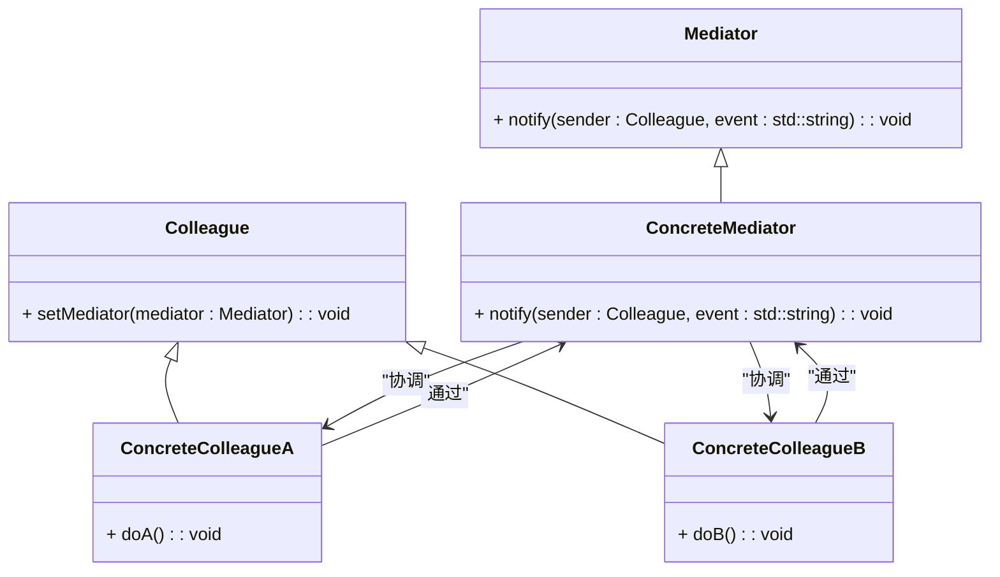

### 中介者模式（Mediator）

中介者模式是一种行为型设计模式，用于定义一个对象的接口，使得一组对象可以通过这个中介者对象进行交互，而不需要直接相互引用。这样可以减少对象之间的耦合度，使得系统更加灵活和可维护。中介者模式主要用于处理对象之间复杂的交互关系，通过中介者对象来管理这些交互。

#### 1. 中介者模式的结构
中介者模式包含以下几个主要组件：
- **Mediator（中介者接口）**: 定义了与中介者进行交互的方法。
- **ConcreteMediator（具体中介者）**: 实现了中介者接口，协调不同的同事对象之间的交互。
- **Colleague（同事接口）**: 定义了与中介者交互的接口。
- **ConcreteColleague（具体同事）**: 实现了同事接口，并通过中介者对象与其他同事进行交互。

#### 2. Mermaid 关系图
以下是中介者模式的类图，用 Mermaid 表示：



#### 3. 中介者模式的实现

**Mediator 中介者接口：**
```cpp
class Colleague;

class Mediator {
public:
    virtual ~Mediator() = default;
    virtual void notify(Colleague* sender, const std::string& event) = 0;
};
```

**ConcreteMediator 具体中介者：**
```cpp
#include <iostream>
#include <vector>

class Colleague {
protected:
    Mediator* mediator;

public:
    void setMediator(Mediator* med) {
        mediator = med;
    }
};

class ConcreteMediator : public Mediator {
private:
    ConcreteColleagueA* colleagueA;
    ConcreteColleagueB* colleagueB;

public:
    ConcreteMediator(ConcreteColleagueA* a, ConcreteColleagueB* b) : colleagueA(a), colleagueB(b) {}

    void notify(Colleague* sender, const std::string& event) override {
        if (sender == colleagueA) {
            std::cout << "Mediator reacts on ConcreteColleagueA's event: " << event << "\n";
            colleagueB->doB();
        } else if (sender == colleagueB) {
            std::cout << "Mediator reacts on ConcreteColleagueB's event: " << event << "\n";
            colleagueA->doA();
        }
    }
};
```

**ConcreteColleagueA 具体同事A：**
```cpp
class ConcreteColleagueA : public Colleague {
public:
    void doA() {
        std::cout << "ConcreteColleagueA does A\n";
        mediator->notify(this, "A");
    }
};
```

**ConcreteColleagueB 具体同事B：**
```cpp
class ConcreteColleagueB : public Colleague {
public:
    void doB() {
        std::cout << "ConcreteColleagueB does B\n";
        mediator->notify(this, "B");
    }
};
```

**Client 客户端代码：**
```cpp
int main() {
    ConcreteColleagueA* colleagueA = new ConcreteColleagueA();
    ConcreteColleagueB* colleagueB = new ConcreteColleagueB();
    ConcreteMediator* mediator = new ConcreteMediator(colleagueA, colleagueB);

    colleagueA->setMediator(mediator);
    colleagueB->setMediator(mediator);

    colleagueA->doA();
    colleagueB->doB();

    delete mediator;
    delete colleagueB;
    delete colleagueA;
    return 0;
}
```

#### 4. 使用中介者模式
在客户端代码中，创建具体的同事对象和中介者对象，并设置同事对象的中介者。通过同事对象调用方法时，所有的交互都由中介者来协调，从而避免了同事对象之间的直接耦合。

#### 5. 总结
中介者模式通过定义一个中介者对象来协调不同对象之间的交互，从而减少了对象之间的直接依赖，使得系统更加灵活和可维护。Mermaid 类图展示了中介者接口、具体中介者、同事接口、具体同事类以及它们之间的关系，帮助理解模式的结构和实现。
s