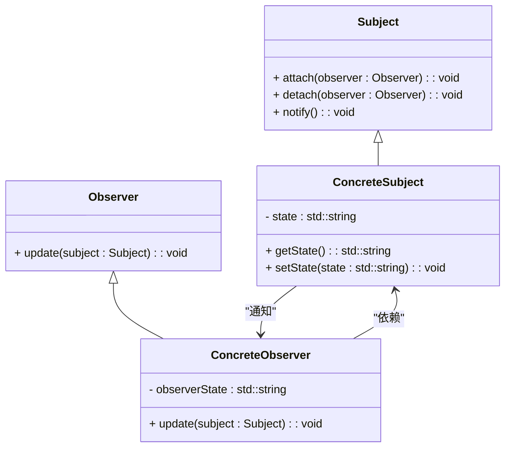

### 观察者模式（Observer）

观察者模式是一种行为型设计模式，用于定义对象之间的一对多依赖关系，使得当一个对象的状态发生变化时，所有依赖于它的对象都会得到通知并自动更新。这种模式常用于实现事件系统和数据绑定，适用于需要响应多个对象对单个对象状态变化的场景。

#### 1. 观察者模式的结构
观察者模式包含以下几个主要组件：
- **Subject（主题）**: 维护一组观察者，并在自身状态改变时通知这些观察者。
- **ConcreteSubject（具体主题）**: 实现了 `Subject` 接口，并在其状态变化时通知所有注册的观察者。
- **Observer（观察者接口）**: 定义了更新的方法，供 `Subject` 调用，以通知观察者状态的变化。
- **ConcreteObserver（具体观察者）**: 实现了 `Observer` 接口，并对 `Subject` 状态变化做出具体反应。

#### 2. Mermaid 关系图
以下是观察者模式的类图，用 Mermaid 表示：



#### 3. 观察者模式的实现

**Subject 主题接口：**
```cpp
#include <vector>
#include <algorithm>

class Observer;

class Subject {
public:
    virtual ~Subject() = default;
    virtual void attach(Observer* observer) = 0;
    virtual void detach(Observer* observer) = 0;
    virtual void notify() = 0;
};
```

**ConcreteSubject 具体主题：**
```cpp
class ConcreteSubject : public Subject {
private:
    std::vector<Observer*> observers;
    std::string state;

public:
    void attach(Observer* observer) override {
        observers.push_back(observer);
    }

    void detach(Observer* observer) override {
        observers.erase(std::remove(observers.begin(), observers.end(), observer), observers.end());
    }

    void notify() override {
        for (Observer* observer : observers) {
            observer->update(this);
        }
    }

    std::string getState() const {
        return state;
    }

    void setState(const std::string& state) {
        this->state = state;
        notify();
    }
};
```

**Observer 观察者接口：**
```cpp
class Subject;

class Observer {
public:
    virtual ~Observer() = default;
    virtual void update(Subject* subject) = 0;
};
```

**ConcreteObserver 具体观察者：**
```cpp
#include <iostream>

class ConcreteObserver : public Observer {
private:
    std::string observerState;

public:
    void update(Subject* subject) override {
        ConcreteSubject* concreteSubject = dynamic_cast<ConcreteSubject*>(subject);
        if (concreteSubject) {
            observerState = concreteSubject->getState();
            std::cout << "ConcreteObserver state updated to: " << observerState << std::endl;
        }
    }
};
```

**Client 客户端代码：**
```cpp
int main() {
    ConcreteSubject* subject = new ConcreteSubject();
    ConcreteObserver* observer1 = new ConcreteObserver();
    ConcreteObserver* observer2 = new ConcreteObserver();

    subject->attach(observer1);
    subject->attach(observer2);

    subject->setState("State1");
    subject->setState("State2");

    delete observer2;
    delete observer1;
    delete subject;

    return 0;
}
```

#### 4. 使用观察者模式
在客户端代码中，创建具体主题和观察者对象，并将观察者对象附加到主题对象上。主题对象状态发生变化时，通过 `notify()` 方法通知所有观察者，使其更新自身状态。观察者对象通过 `update()` 方法响应状态的变化。

#### 5. 总结
观察者模式通过定义一对多的依赖关系，使得一个对象的状态改变时，所有依赖于它的对象都会得到通知并自动更新，从而实现了灵活的事件处理机制。Mermaid 类图展示了主题、观察者接口、具体主题、具体观察者以及它们之间的关系，帮助理解模式的结构和实现。
