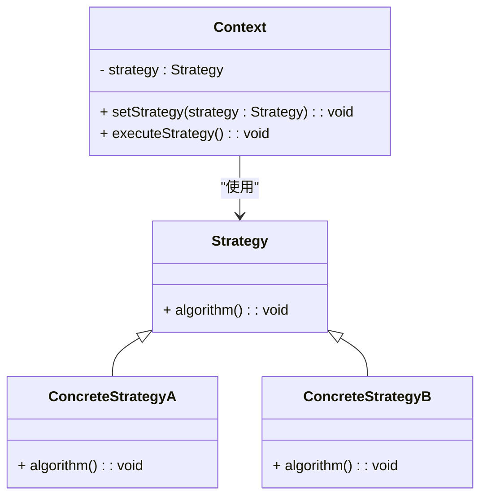

### 策略模式（Strategy）

策略模式是一种行为型设计模式，用于定义一系列算法，将每一个算法封装起来，并使它们可以互换。策略模式让算法的变化独立于使用算法的客户。它的主要目的是通过将算法的定义和算法的使用解耦，从而使得客户端可以选择不同的算法而无需修改其使用方式。

#### 1. 策略模式的结构
策略模式包含以下几个主要组件：
- **Context（上下文）**: 维护一个对策略对象的引用，并能够调用策略对象的方法来完成所需的功能。上下文类通常会持有一个策略接口的引用。
- **Strategy（策略接口）**: 定义了一个算法接口，让具体策略类可以实现该接口。
- **ConcreteStrategy（具体策略）**: 实现了策略接口中的具体算法。

#### 2. Mermaid 关系图
以下是策略模式的类图，用 Mermaid 表示：



#### 3. 策略模式的实现

**Strategy 策略接口：**
```cpp
class Strategy {
public:
    virtual ~Strategy() = default;
    virtual void algorithm() = 0;
};
```

**ConcreteStrategyA 具体策略A：**
```cpp
#include <iostream>

class ConcreteStrategyA : public Strategy {
public:
    void algorithm() override {
        std::cout << "Executing algorithm A" << std::endl;
    }
};
```

**ConcreteStrategyB 具体策略B：**
```cpp
#include <iostream>

class ConcreteStrategyB : public Strategy {
public:
    void algorithm() override {
        std::cout << "Executing algorithm B" << std::endl;
    }
};
```

**Context 上下文：**
```cpp
class Context {
private:
    Strategy* strategy;

public:
    Context(Strategy* strategy) : strategy(strategy) {}

    void setStrategy(Strategy* newStrategy) {
        strategy = newStrategy;
    }

    void executeStrategy() {
        strategy->algorithm();
    }
};
```

**Client 客户端代码：**
```cpp
int main() {
    ConcreteStrategyA* strategyA = new ConcreteStrategyA();
    ConcreteStrategyB* strategyB = new ConcreteStrategyB();
    
    Context* context = new Context(strategyA);
    
    context->executeStrategy();
    
    context->setStrategy(strategyB);
    context->executeStrategy();
    
    delete strategyA;
    delete strategyB;
    delete context;

    return 0;
}
```

#### 4. 使用策略模式
在客户端代码中，创建具体策略对象并将其设置为上下文的当前策略。调用上下文的 `executeStrategy()` 方法时，策略对象会执行相应的算法。通过改变上下文的策略，可以实现算法的动态切换，而无需修改上下文的代码。

#### 5. 总结
策略模式通过将算法封装到独立的策略对象中，使得算法的变化与使用算法的客户端解耦。客户端可以通过上下文对象来切换不同的策略，而无需了解策略的内部实现。Mermaid 类图展示了上下文、策略接口、具体策略类以及它们之间的关系，帮助理解模式的结构和实现。
