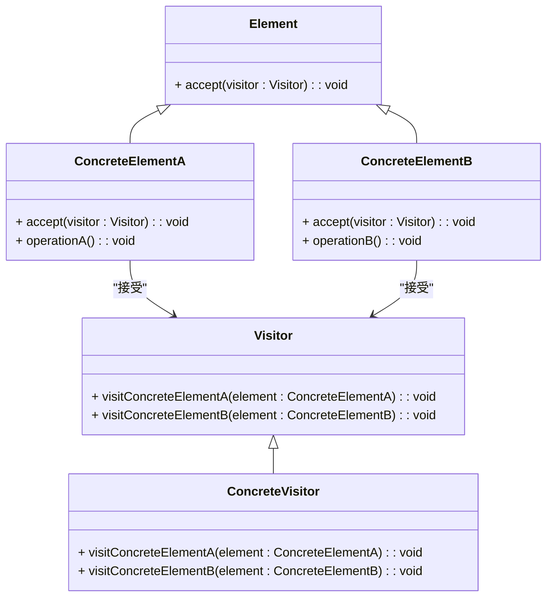

### 访问者模式（Visitor）

访问者模式是一种行为型设计模式，用于将操作封装在访问者对象中，使得在不修改被操作对象的类的情况下，可以对这些对象进行操作。这种模式允许在不改变元素类的情况下，定义新的操作。访问者模式通常用于处理复杂的对象结构，并允许添加新的操作而不需要修改对象结构。

#### 1. 访问者模式的结构
访问者模式包含以下几个主要组件：
- **Element（元素接口）**: 定义了一个接受访问者的接口。每个元素类必须实现这个接口，以接受访问者。
- **ConcreteElement（具体元素）**: 实现了 `Element` 接口，并定义了具体的元素类。
- **Visitor（访问者接口）**: 定义了对每个具体元素类操作的方法。
- **ConcreteVisitor（具体访问者）**: 实现了 `Visitor` 接口，并定义了对每个具体元素类的具体操作。
- **ObjectStructure（对象结构）**: 维护一个元素对象的集合，允许访问者遍历这些元素。

#### 2. Mermaid 关系图
以下是访问者模式的类图，用 Mermaid 表示：



#### 3. 访问者模式的实现

**Element 元素接口：**
```cpp
class Visitor; // 前向声明

class Element {
public:
    virtual ~Element() = default;
    virtual void accept(Visitor* visitor) = 0;
};
```

**ConcreteElementA 具体元素A：**
```cpp
#include <iostream>

class ConcreteElementA : public Element {
public:
    void accept(Visitor* visitor) override;
    void operationA() {
        std::cout << "ConcreteElementA operation" << std::endl;
    }
};
```

**ConcreteElementB 具体元素B：**
```cpp
#include <iostream>

class ConcreteElementB : public Element {
public:
    void accept(Visitor* visitor) override;
    void operationB() {
        std::cout << "ConcreteElementB operation" << std::endl;
    }
};
```

**Visitor 访问者接口：**
```cpp
class ConcreteElementA; // 前向声明
class ConcreteElementB; // 前向声明

class Visitor {
public:
    virtual ~Visitor() = default;
    virtual void visitConcreteElementA(ConcreteElementA* element) = 0;
    virtual void visitConcreteElementB(ConcreteElementB* element) = 0;
};
```

**ConcreteVisitor 具体访问者：**
```cpp
#include <iostream>

class ConcreteVisitor : public Visitor {
public:
    void visitConcreteElementA(ConcreteElementA* element) override {
        std::cout << "Visiting ConcreteElementA" << std::endl;
        element->operationA();
    }

    void visitConcreteElementB(ConcreteElementB* element) override {
        std::cout << "Visiting ConcreteElementB" << std::endl;
        element->operationB();
    }
};
```

**具体元素类中的 `accept` 方法实现：**

**ConcreteElementA 中的 `accept` 方法：**
```cpp
void ConcreteElementA::accept(Visitor* visitor) {
    visitor->visitConcreteElementA(this);
}
```

**ConcreteElementB 中的 `accept` 方法：**
```cpp
void ConcreteElementB::accept(Visitor* visitor) {
    visitor->visitConcreteElementB(this);
}
```

**Client 客户端代码：**
```cpp
int main() {
    ConcreteElementA* elementA = new ConcreteElementA();
    ConcreteElementB* elementB = new ConcreteElementB();
    ConcreteVisitor* visitor = new ConcreteVisitor();

    elementA->accept(visitor);
    elementB->accept(visitor);

    delete elementA;
    delete elementB;
    delete visitor;

    return 0;
}
```

#### 4. 使用访问者模式
在客户端代码中，创建具体元素和具体访问者对象。通过调用具体元素的 `accept()` 方法，传入访问者对象，访问者对象会根据元素的类型执行相应的操作。这种方式允许添加新的操作而不需要修改具体元素的代码。

#### 5. 总结
访问者模式通过将操作封装在访问者对象中，使得在不修改元素类的情况下，可以对这些元素进行不同的操作。这种模式特别适合处理复杂的对象结构，并允许在不修改对象结构的情况下增加新的操作。Mermaid 类图展示了元素接口、具体元素类、访问者接口、具体访问者类及它们之间的关系，帮助理解模式的结构和实现。