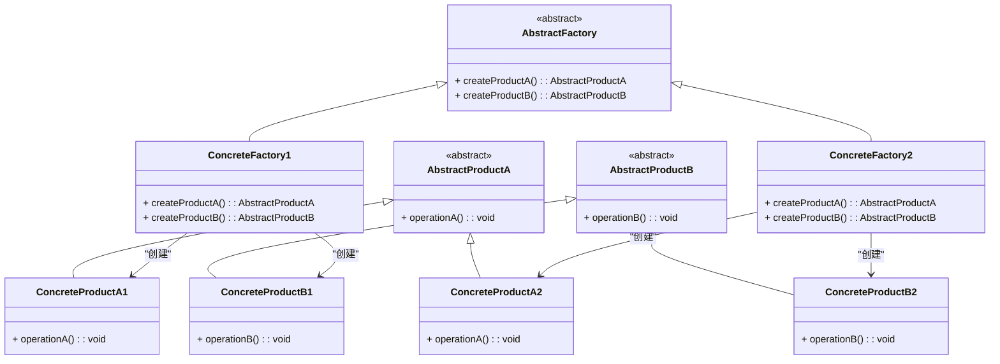

### 抽象工厂模式（Abstract Factory）

抽象工厂模式是一种创建型设计模式，它提供了一个接口，用于创建一系列相关或互相依赖的对象，而无需指定它们的具体类。通过使用抽象工厂模式，客户端可以创建产品族中的对象，而不必了解这些对象的具体实现。

#### 1. 抽象工厂模式的结构
抽象工厂模式的核心在于为产品族中的各个产品提供一组接口，并且具体的工厂类将实现这些接口来创建产品。

- **AbstractFactory（抽象工厂）**: 声明了一组创建各种抽象产品的方法。
- **ConcreteFactory（具体工厂）**: 实现了创建具体产品对象的方法。
- **AbstractProduct（抽象产品）**: 为产品对象声明一个接口。
- **ConcreteProduct（具体产品）**: 定义一个将由相应的具体工厂创建的产品对象。

#### 2. Mermaid 关系图
以下是抽象工厂模式的类图，用 Mermaid 表示：



#### 3. 抽象工厂模式的实现

**AbstractFactory 抽象工厂类：**
```cpp
class AbstractFactory {
public:
    virtual ~AbstractFactory() = default;
    virtual AbstractProductA* createProductA() const = 0;
    virtual AbstractProductB* createProductB() const = 0;
};
```

**ConcreteFactory1 具体工厂类：**
```cpp
class ConcreteFactory1 : public AbstractFactory {
public:
    AbstractProductA* createProductA() const override {
        return new ConcreteProductA1();
    }
    
    AbstractProductB* createProductB() const override {
        return new ConcreteProductB1();
    }
};
```

**ConcreteFactory2 具体工厂类：**
```cpp
class ConcreteFactory2 : public AbstractFactory {
public:
    AbstractProductA* createProductA() const override {
        return new ConcreteProductA2();
    }
    
    AbstractProductB* createProductB() const override {
        return new ConcreteProductB2();
    }
};
```

**AbstractProductA 抽象产品A类：**
```cpp
class AbstractProductA {
public:
    virtual ~AbstractProductA() = default;
    virtual void operationA() const = 0;
};
```

**ConcreteProductA1 具体产品A1类：**
```cpp
class ConcreteProductA1 : public AbstractProductA {
public:
    void operationA() const override {
        std::cout << "Operation by ConcreteProductA1\n";
    }
};
```

**ConcreteProductA2 具体产品A2类：**
```cpp
class ConcreteProductA2 : public AbstractProductA {
public:
    void operationA() const override {
        std::cout << "Operation by ConcreteProductA2\n";
    }
};
```

**AbstractProductB 抽象产品B类：**
```cpp
class AbstractProductB {
public:
    virtual ~AbstractProductB() = default;
    virtual void operationB() const = 0;
};
```

**ConcreteProductB1 具体产品B1类：**
```cpp
class ConcreteProductB1 : public AbstractProductB {
public:
    void operationB() const override {
        std::cout << "Operation by ConcreteProductB1\n";
    }
};
```

**ConcreteProductB2 具体产品B2类：**
```cpp
class ConcreteProductB2 : public AbstractProductB {
public:
    void operationB() const override {
        std::cout << "Operation by ConcreteProductB2\n";
    }
};
```

#### 4. 使用抽象工厂模式
在客户端代码中，可以通过使用抽象工厂类的指针来实例化具体工厂并创建相应的产品。示例：

```cpp
void ClientCode(const AbstractFactory& factory) {
    const AbstractProductA* productA = factory.createProductA();
    const AbstractProductB* productB = factory.createProductB();
    productA->operationA();
    productB->operationB();
    delete productA;
    delete productB;
}

int main() {
    ConcreteFactory1* factory1 = new ConcreteFactory1();
    ClientCode(*factory1);

    ConcreteFactory2* factory2 = new ConcreteFactory2();
    ClientCode(*factory2);

    delete factory1;
    delete factory2;
    return 0;
}
```

#### 5. 总结
抽象工厂模式通过为一系列相关的产品提供接口，允许客户端在不知道具体类的情况下创建不同的产品族。Mermaid 类图展示了工厂和产品之间的关系，帮助理解模式的实现结构。

