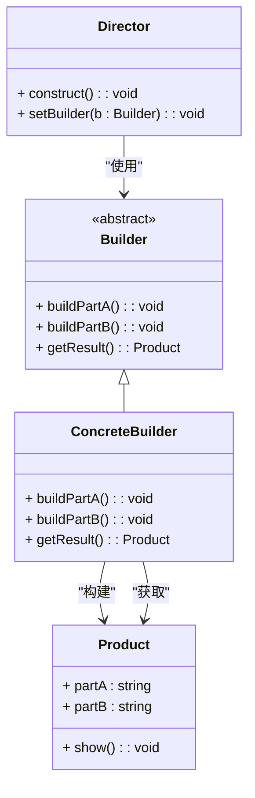

### 建造者模式（Builder）

建造者模式是一种创建型设计模式，用于构造复杂对象。它允许将一个复杂对象的构建过程分解成多个步骤，并通过建造者的不同实现来创建不同的对象。建造者模式特别适用于需要创建复杂产品的场景，这些产品可能由多个组件组成。

#### 1. 建造者模式的结构
建造者模式包含以下几个主要组件：
- **Builder（建造者）**: 定义了构建产品的各个步骤，并提供一个方法来获取构建好的产品。
- **ConcreteBuilder（具体建造者）**: 实现了 `Builder` 接口，具体构建各个部件并定义如何组装产品。
- **Product（产品）**: 由建造者构建的复杂对象，通常包括多个部件。
- **Director（指挥者）**: 负责控制建造过程，调用建造者的步骤来创建一个完整的产品。

#### 2. Mermaid 关系图
以下是建造者模式的类图，用 Mermaid 表示：



#### 3. 建造者模式的实现

**Builder 抽象建造者类：**
```cpp
class Builder {
public:
    virtual ~Builder() = default;
    virtual void buildPartA() = 0;
    virtual void buildPartB() = 0;
    virtual Product* getResult() = 0;
};
```

**ConcreteBuilder 具体建造者类：**
```cpp
class ConcreteBuilder : public Builder {
private:
    Product* product;

public:
    ConcreteBuilder() {
        this->reset();
    }

    ~ConcreteBuilder() {
        delete product;
    }

    void reset() {
        this->product = new Product();
    }

    void buildPartA() override {
        this->product->partA = "PartA";
    }

    void buildPartB() override {
        this->product->partB = "PartB";
    }

    Product* getResult() override {
        Product* result = this->product;
        this->reset();
        return result;
    }
};
```

**Product 复杂产品类：**
```cpp
class Product {
public:
    std::string partA;
    std::string partB;

    void show() const {
        std::cout << "Product Parts: " << partA << ", " << partB << std::endl;
    }
};
```

**Director 指挥者类：**
```cpp
class Director {
private:
    Builder* builder;

public:
    void setBuilder(Builder* builder) {
        this->builder = builder;
    }

    void construct() {
        this->builder->buildPartA();
        this->builder->buildPartB();
    }
};
```

#### 4. 使用建造者模式
在客户端代码中，可以使用指挥者来控制建造过程，通过建造者来获取最终的产品。示例：

```cpp
int main() {
    ConcreteBuilder* builder = new ConcreteBuilder();
    Director director;

    director.setBuilder(builder);
    director.construct();

    Product* product = builder->getResult();
    product->show();

    delete product;
    delete builder;
    return 0;
}
```

#### 5. 总结
建造者模式通过将对象的构建过程与表示分离，使得创建复杂对象的过程更加灵活和可控。Mermaid 类图清晰地展示了建造者、具体建造者、指挥者和产品之间的关系，有助于理解该模式的实现和应用场景。

