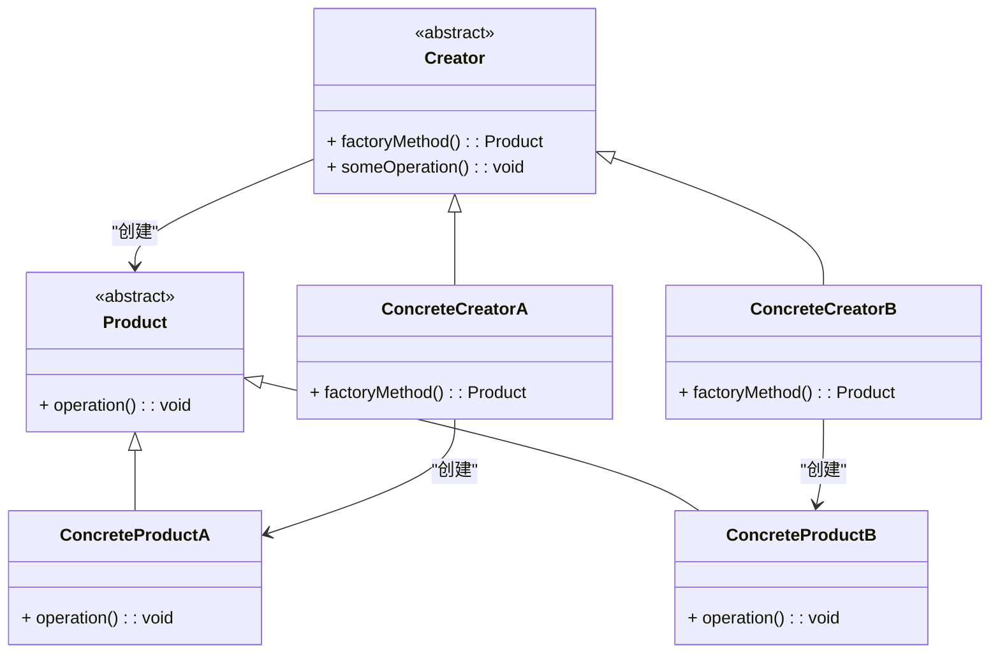

### 工厂方法模式（Factory Method）

工厂方法模式是一种创建型设计模式，它定义了一个用于创建对象的接口，但由子类决定实例化哪个类。这样，工厂方法将对象的创建过程延迟到子类中进行。

#### 1. 工厂方法模式的结构
工厂方法模式包含以下几个主要组件：
- **Product（产品）**: 定义了工厂方法创建的对象的接口或抽象类。
- **ConcreteProduct（具体产品）**: 实现了 `Product` 接口或继承自抽象类的具体对象。
- **Creator（创建者）**: 声明了返回 `Product` 类型的工厂方法，且可以包含调用工厂方法以创建对象的逻辑。
- **ConcreteCreator（具体创建者）**: 实现了工厂方法，返回具体的 `ConcreteProduct` 实例。

#### 2. Mermaid 关系图
以下是工厂方法模式的类图，用 Mermaid 表示：



#### 3. 工厂方法模式的实现

**Product 抽象类：**
```cpp
class Product {
public:
    virtual void operation() const = 0;
    virtual ~Product() = default;
};
```

**ConcreteProductA 具体产品：**
```cpp
class ConcreteProductA : public Product {
public:
    void operation() const override {
        std::cout << "Operation by ConcreteProductA\n";
    }
};
```

**ConcreteProductB 具体产品：**
```cpp
class ConcreteProductB : public Product {
public:
    void operation() const override {
        std::cout << "Operation by ConcreteProductB\n";
    }
};
```

**Creator 抽象类：**
```cpp
class Creator {
public:
    virtual ~Creator() = default;

    // 工厂方法
    virtual Product* factoryMethod() const = 0;

    void someOperation() const {
        Product* product = this->factoryMethod();
        product->operation();
        delete product;
    }
};
```

**ConcreteCreatorA 具体创建者：**
```cpp
class ConcreteCreatorA : public Creator {
public:
    Product* factoryMethod() const override {
        return new ConcreteProductA();
    }
};
```

**ConcreteCreatorB 具体创建者：**
```cpp
class ConcreteCreatorB : public Creator {
public:
    Product* factoryMethod() const override {
        return new ConcreteProductB();
    }
};
```

#### 4. 使用工厂方法模式
在客户端代码中，创建具体产品的细节通过调用创建者的工厂方法来隐藏。示例：

```cpp
void ClientCode(const Creator& creator) {
    creator.someOperation();
}

int main() {
    Creator* creatorA = new ConcreteCreatorA();
    ClientCode(*creatorA);

    Creator* creatorB = new ConcreteCreatorB();
    ClientCode(*creatorB);

    delete creatorA;
    delete creatorB;
    return 0;
}
```

#### 5. 总结
工厂方法模式通过将对象的创建延迟到子类中，遵循了开放/封闭原则，增加了系统的灵活性和可扩展性。Mermaid 类图清晰地展示了类之间的关系，有助于理解这种模式的结构和实现。

