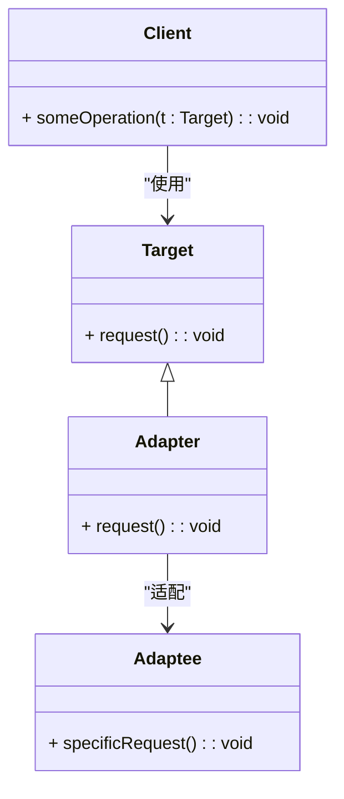

### 适配器模式（Adapter）

适配器模式是一种结构型设计模式，用于使接口不兼容的类可以协同工作。通过使用适配器模式，可以将一个类的接口转换成客户端所期望的另一种接口，使得原本由于接口不兼容而不能一起工作的类可以一起工作。

#### 1. 适配器模式的结构
适配器模式包含以下几个主要组件：
- **Target（目标接口）**: 客户端期望的接口。
- **Adapter（适配器）**: 通过继承或实现目标接口，将适配者的接口转换成目标接口。
- **Adaptee（适配者）**: 需要适配的接口或类。
- **Client（客户端）**: 通过目标接口调用适配器，使其能够与适配者协同工作。

#### 2. Mermaid 关系图
以下是适配器模式的类图，用 Mermaid 表示：



#### 3. 适配器模式的实现

**Target 目标接口：**
```cpp
class Target {
public:
    virtual ~Target() = default;
    virtual void request() const = 0;
};
```

**Adaptee 适配者类：**
```cpp
class Adaptee {
public:
    void specificRequest() const {
        std::cout << "Specific request from Adaptee\n";
    }
};
```

**Adapter 适配器类：**
```cpp
class Adapter : public Target {
private:
    Adaptee* adaptee;

public:
    Adapter(Adaptee* a) : adaptee(a) {}

    void request() const override {
        this->adaptee->specificRequest();
    }
};
```

**Client 客户端代码：**
```cpp
void ClientCode(const Target& target) {
    target.request();
}

int main() {
    Adaptee* adaptee = new Adaptee();
    Adapter* adapter = new Adapter(adaptee);

    ClientCode(*adapter);

    delete adaptee;
    delete adapter;
    return 0;
}
```

#### 4. 使用适配器模式
在客户端代码中，适配器将适配者的接口转换为客户端期望的接口。这样，客户端可以使用统一的目标接口与不同的适配者进行交互，而无需知道具体的适配者实现细节。

#### 5. 总结
适配器模式通过转换接口使得不兼容的类能够协同工作，适用于系统中接口不兼容的情况。Mermaid 类图展示了目标接口、适配器、适配者和客户端之间的关系，帮助理解模式的结构和实现。