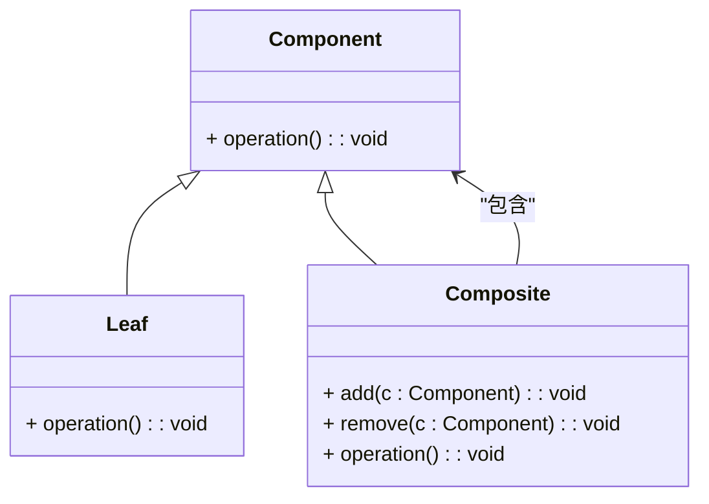

### 组合模式（Composite）

组合模式是一种结构型设计模式，用于将对象组合成树形结构以表示“部分-整体”的层次结构。组合模式允许客户端以统一的方式对待单个对象和对象的集合，使得可以通过相同的接口来操作对象和它们的组合。

#### 1. 组合模式的结构
组合模式包含以下几个主要组件：
- **Component（组件）**: 定义了叶子对象和组合对象的公共接口，声明了叶子和组合的公共方法。
- **Leaf（叶子）**: 实现了 `Component` 接口，并且代表树叶节点。叶子对象是不能有子节点的。
- **Composite（组合）**: 实现了 `Component` 接口，并且能够有子节点（叶子或其他组合对象）。组合对象负责管理子节点，并实现对这些子节点的操作。

#### 2. Mermaid 关系图
以下是组合模式的类图，用 Mermaid 表示：



#### 3. 组合模式的实现

**Component 组件接口：**
```cpp
class Component {
public:
    virtual ~Component() = default;
    virtual void operation() const = 0;
};
```

**Leaf 叶子类：**
```cpp
class Leaf : public Component {
public:
    void operation() const override {
        std::cout << "Leaf operation\n";
    }
};
```

**Composite 组合类：**
```cpp
#include <vector>
#include <memory>

class Composite : public Component {
private:
    std::vector<std::shared_ptr<Component>> children;

public:
    void add(std::shared_ptr<Component> component) {
        children.push_back(component);
    }

    void remove(std::shared_ptr<Component> component) {
        children.erase(std::remove(children.begin(), children.end(), component), children.end());
    }

    void operation() const override {
        std::cout << "Composite operation\n";
        for (const auto& child : children) {
            child->operation();
        }
    }
};
```

**Client 客户端代码：**
```cpp
int main() {
    std::shared_ptr<Component> leaf1 = std::make_shared<Leaf>();
    std::shared_ptr<Component> leaf2 = std::make_shared<Leaf>();

    Composite composite;
    composite.add(leaf1);
    composite.add(leaf2);

    composite.operation();

    return 0;
}
```

#### 4. 使用组合模式
在客户端代码中，可以将叶子对象和组合对象通过相同的接口进行操作。组合模式允许客户端以统一的方式处理复杂的树形结构，而无需区分单个对象和组合对象。

#### 5. 总结
组合模式通过将对象组合成树形结构来表示部分-整体的层次结构，使得客户端能够以一致的方式对待单个对象和对象集合。Mermaid 类图展示了组件接口、叶子类、组合类以及它们之间的关系，帮助理解模式的结构和实现。
