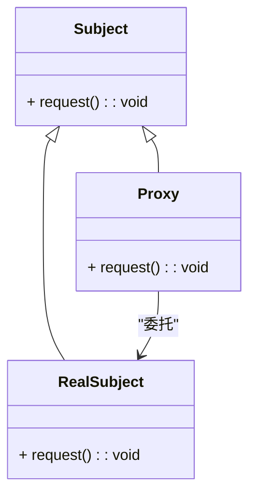

### 代理模式（Proxy）

代理模式是一种结构型设计模式，用于为另一个对象提供一个替代品或占位符。代理模式可以用于控制对对象的访问，例如延迟对象的创建、控制对对象的访问权限、增加额外的功能等。代理模式通常涉及到以下几种类型的代理：
- **虚拟代理**：用于延迟对象的创建，直到真正需要对象的时候。
- **保护代理**：用于控制对对象的访问权限，确保只有特定的客户端可以访问。
- **遥控代理**：用于在网络上访问远程对象。

#### 1. 代理模式的结构
代理模式包含以下几个主要组件：
- **Subject（主题接口）**: 定义了代理和真实主题所需的共同接口。
- **RealSubject（真实主题）**: 实现了 `Subject` 接口，并且包含实际的业务逻辑。
- **Proxy（代理）**: 实现了 `Subject` 接口，并且持有对 `RealSubject` 的引用。代理对象可以在实际调用 `RealSubject` 的方法之前或之后增加额外的功能。

#### 2. Mermaid 关系图
以下是代理模式的类图，用 Mermaid 表示：



#### 3. 代理模式的实现

**Subject 主题接口：**
```cpp
class Subject {
public:
    virtual ~Subject() = default;
    virtual void request() const = 0;
};
```

**RealSubject 真实主题类：**
```cpp
class RealSubject : public Subject {
public:
    void request() const override {
        std::cout << "RealSubject request\n";
    }
};
```

**Proxy 代理类：**
```cpp
class Proxy : public Subject {
private:
    std::shared_ptr<RealSubject> realSubject;

public:
    Proxy() : realSubject(std::make_shared<RealSubject>()) {}

    void request() const override {
        std::cout << "Proxy request: Delegating to RealSubject\n";
        realSubject->request();
    }
};
```

**Client 客户端代码：**
```cpp
int main() {
    std::shared_ptr<Subject> proxy = std::make_shared<Proxy>();
    proxy->request();

    return 0;
}
```

#### 4. 使用代理模式
在客户端代码中，使用代理对象来访问真实主题对象。代理对象可以在实际调用真实主题对象的方法之前或之后执行额外的操作，例如日志记录、权限检查、延迟加载等。

#### 5. 总结
代理模式通过为对象提供一个替代品或占位符来控制对真实对象的访问。代理模式包括不同类型的代理，如虚拟代理、保护代理和遥控代理。Mermaid 类图展示了主题接口、真实主题类、代理类以及它们之间的关系，帮助理解模式的结构和实现。