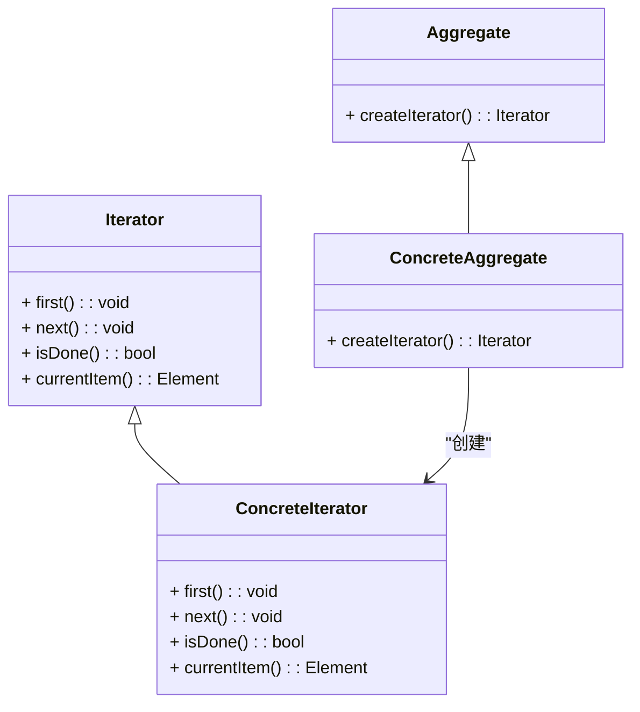

### 迭代器模式（Iterator）

迭代器模式是一种行为型设计模式，提供一种方法来顺序访问一个集合对象中的元素，而无需暴露集合对象的内部表示。迭代器模式使得可以使用统一的接口来遍历不同的数据结构，提高了系统的灵活性和可扩展性。

#### 1. 迭代器模式的结构
迭代器模式包含以下几个主要组件：
- **Iterator（迭代器接口）**: 定义了访问集合元素的接口，包括获取当前元素、移动到下一个元素、检查是否有更多元素等方法。
- **ConcreteIterator（具体迭代器）**: 实现了 `Iterator` 接口，并维护对具体集合的引用，用于遍历集合中的元素。
- **Aggregate（聚合接口）**: 定义了创建迭代器的接口，通常是一个容器或集合。
- **ConcreteAggregate（具体聚合）**: 实现了 `Aggregate` 接口，并返回一个具体的迭代器对象。

#### 2. Mermaid 关系图
以下是迭代器模式的类图，用 Mermaid 表示：



#### 3. 迭代器模式的实现

**Iterator 迭代器接口：**
```cpp
template<typename T>
class Iterator {
public:
    virtual ~Iterator() = default;
    virtual void first() = 0;
    virtual void next() = 0;
    virtual bool isDone() const = 0;
    virtual T currentItem() const = 0;
};
```

**ConcreteIterator 具体迭代器：**
```cpp
template<typename T>
class ConcreteIterator : public Iterator<T> {
private:
    ConcreteAggregate<T>* aggregate;
    size_t current;

public:
    ConcreteIterator(ConcreteAggregate<T>* agg) : aggregate(agg), current(0) {}

    void first() override {
        current = 0;
    }

    void next() override {
        if (!isDone()) {
            ++current;
        }
    }

    bool isDone() const override {
        return current >= aggregate->size();
    }

    T currentItem() const override {
        return aggregate->get(current);
    }
};
```

**Aggregate 聚合接口：**
```cpp
template<typename T>
class Aggregate {
public:
    virtual ~Aggregate() = default;
    virtual Iterator<T>* createIterator() const = 0;
};
```

**ConcreteAggregate 具体聚合：**
```cpp
template<typename T>
class ConcreteAggregate : public Aggregate<T> {
private:
    std::vector<T> items;

public:
    void add(const T& item) {
        items.push_back(item);
    }

    T get(size_t index) const {
        return items.at(index);
    }

    size_t size() const {
        return items.size();
    }

    Iterator<T>* createIterator() const override {
        return new ConcreteIterator<T>(const_cast<ConcreteAggregate<T>*>(this));
    }
};
```

**Client 客户端代码：**
```cpp
int main() {
    ConcreteAggregate<int> aggregate;
    aggregate.add(1);
    aggregate.add(2);
    aggregate.add(3);

    Iterator<int>* iterator = aggregate.createIterator();
    for (iterator->first(); !iterator->isDone(); iterator->next()) {
        std::cout << iterator->currentItem() << " ";
    }
    std::cout << std::endl;

    delete iterator;
    return 0;
}
```

#### 4. 使用迭代器模式
在客户端代码中，创建具体聚合对象并向其中添加元素。然后，使用迭代器遍历聚合对象中的元素。通过迭代器，可以在不暴露集合内部实现的情况下顺序访问集合中的元素。

#### 5. 总结
迭代器模式通过提供一种方法来顺序访问集合中的元素，而无需暴露集合对象的内部表示，增强了代码的灵活性和可扩展性。Mermaid 类图展示了迭代器接口、具体迭代器、聚合接口、具体聚合类以及它们之间的关系，帮助理解模式的结构和实现。