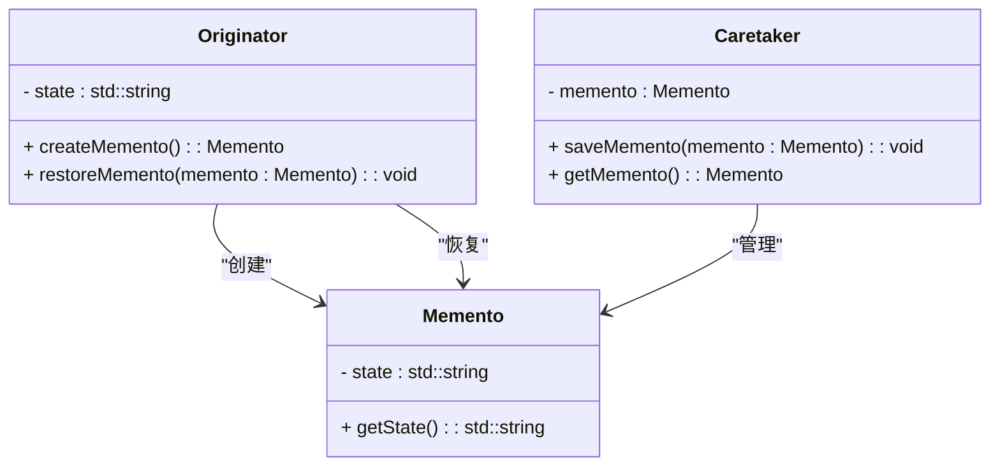

### 备忘录模式（Memento）

备忘录模式是一种行为型设计模式，用于在不暴露对象内部状态的情况下，保存和恢复对象的状态。它使得可以在对象状态改变时保存其原始状态，并在需要时恢复到之前的状态。这对于实现撤销操作、恢复状态等功能非常有用。

#### 1. 备忘录模式的结构
备忘录模式包含以下几个主要组件：
- **Memento（备忘录）**: 存储对象的内部状态。备忘录对象只能由发起人对象访问，确保状态的安全性。
- **Originator（发起人）**: 创建备忘录对象并使用备忘录对象恢复自身的状态。发起人对象维护其内部状态，并能够保存和恢复状态。
- **Caretaker（看护者）**: 负责保存和管理备忘录对象，但不直接操作备忘录的内容。看护者对象可以请求备忘录的保存和恢复，但不关心备忘录的内部实现。

#### 2. Mermaid 关系图
以下是备忘录模式的类图，用 Mermaid 表示：



#### 3. 备忘录模式的实现

**Memento 备忘录：**
```cpp
class Memento {
private:
    std::string state;

public:
    Memento(const std::string& state) : state(state) {}

    std::string getState() const {
        return state;
    }
};
```

**Originator 发起人：**
```cpp
#include <iostream>

class Originator {
private:
    std::string state;

public:
    void setState(const std::string& state) {
        this->state = state;
    }

    std::string getState() const {
        return state;
    }

    Memento createMemento() const {
        return Memento(state);
    }

    void restoreMemento(const Memento& memento) {
        state = memento.getState();
    }
};
```

**Caretaker 看护者：**
```cpp
class Caretaker {
private:
    Memento memento;

public:
    void saveMemento(const Memento& memento) {
        this->memento = memento;
    }

    Memento getMemento() const {
        return memento;
    }
};
```

**Client 客户端代码：**
```cpp
int main() {
    Originator originator;
    Caretaker caretaker;

    originator.setState("State1");
    std::cout << "Originator current state: " << originator.getState() << std::endl;

    // Save state to memento
    caretaker.saveMemento(originator.createMemento());

    // Change state
    originator.setState("State2");
    std::cout << "Originator current state: " << originator.getState() << std::endl;

    // Restore state from memento
    originator.restoreMemento(caretaker.getMemento());
    std::cout << "Originator restored state: " << originator.getState() << std::endl;

    return 0;
}
```

#### 4. 使用备忘录模式
在客户端代码中，创建发起人对象并设置其状态。将发起人的状态保存到备忘录中，然后修改发起人的状态。使用看护者保存和恢复备忘录对象，从而可以在需要时恢复到之前的状态。

#### 5. 总结
备忘录模式通过提供一个机制来保存和恢复对象的内部状态，而不暴露其内部结构，从而使得系统能够实现状态的撤销和恢复功能。Mermaid 类图展示了备忘录、发起人、看护者以及它们之间的关系，帮助理解模式的结构和实现。
