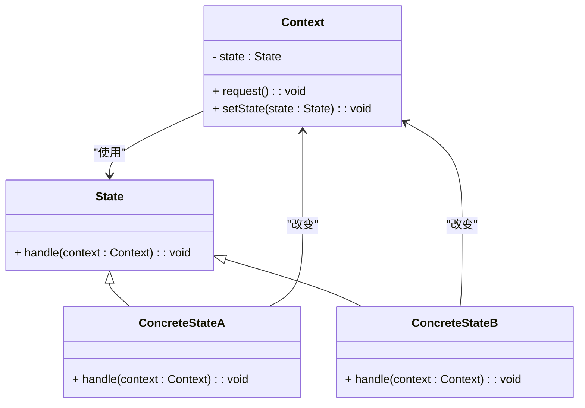

### 状态模式（State）

状态模式是一种行为型设计模式，用于允许一个对象在其内部状态改变时改变其行为，使得对象看起来像是修改了其类。该模式将状态的行为封装在状态对象中，并通过状态对象来控制状态转换，从而使得状态和状态之间的转换变得更加清晰和易于管理。

#### 1. 状态模式的结构
状态模式包含以下几个主要组件：
- **Context（上下文）**: 维护一个具体的状态对象，并定义与客户端交互的接口。上下文对象可以根据状态对象的变化来改变其行为。
- **State（状态接口）**: 定义了一个接口，用于具体状态类来实现不同的状态行为。
- **ConcreteState（具体状态）**: 实现了状态接口中的具体行为，并定义了如何根据当前状态改变上下文的状态。

#### 2. Mermaid 关系图
以下是状态模式的类图，用 Mermaid 表示：



#### 3. 状态模式的实现

**State 状态接口：**
```cpp
class Context;

class State {
public:
    virtual ~State() = default;
    virtual void handle(Context* context) = 0;
};
```

**ConcreteStateA 具体状态A：**
```cpp
#include <iostream>

class ConcreteStateA : public State {
public:
    void handle(Context* context) override;
};
```

**ConcreteStateB 具体状态B：**
```cpp
#include <iostream>

class ConcreteStateB : public State {
public:
    void handle(Context* context) override;
};
```

**Context 上下文：**
```cpp
class Context {
private:
    State* state;

public:
    Context(State* state) : state(state) {}

    void setState(State* newState) {
        state = newState;
    }

    void request() {
        state->handle(this);
    }
};
```

**具体状态的实现：**

**ConcreteStateA 具体状态A的实现：**
```cpp
void ConcreteStateA::handle(Context* context) {
    std::cout << "Handling request in ConcreteStateA" << std::endl;
    // Change state
    context->setState(new ConcreteStateB());
}
```

**ConcreteStateB 具体状态B的实现：**
```cpp
void ConcreteStateB::handle(Context* context) {
    std::cout << "Handling request in ConcreteStateB" << std::endl;
    // Change state
    context->setState(new ConcreteStateA());
}
```

**Client 客户端代码：**
```cpp
int main() {
    ConcreteStateA* stateA = new ConcreteStateA();
    ConcreteStateB* stateB = new ConcreteStateB();
    
    Context* context = new Context(stateA);
    
    context->request();
    context->request();
    
    delete stateA;
    delete stateB;
    delete context;

    return 0;
}
```

#### 4. 使用状态模式
在客户端代码中，创建具体状态对象，并将其设置为上下文的当前状态。调用上下文的 `request()` 方法时，状态对象会执行相应的处理，并可能改变上下文的状态。每次请求都会根据当前状态执行不同的操作，并自动切换到新的状态。

#### 5. 总结
状态模式通过将状态的行为封装在状态对象中，使得状态之间的转换变得更加清晰和可管理。通过状态对象来控制上下文的行为，使得状态的切换变得更加自然和灵活。Mermaid 类图展示了上下文、状态接口、具体状态类以及它们之间的关系，帮助理解模式的结构和实现。
