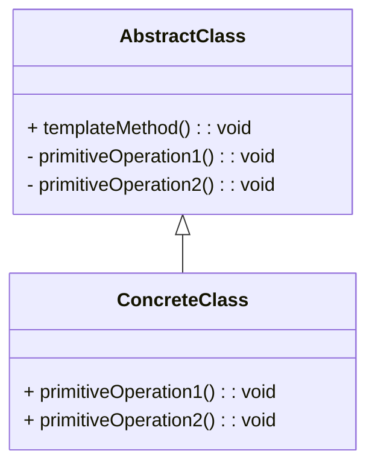

### 模板方法模式（Template Method）

模板方法模式是一种行为型设计模式，用于定义一个算法的框架，并将一些步骤延迟到子类中。模板方法模式允许子类在不改变算法结构的情况下重新定义算法中的某些步骤。这种模式可以使得算法的整体结构保持不变，而具体的步骤可以由子类进行实现。

#### 1. 模板方法模式的结构
模板方法模式包含以下几个主要组件：
- **AbstractClass（抽象类）**: 定义一个模板方法，包含算法的基本框架，并将一些步骤的实现延迟到子类中。抽象类还定义了具体步骤的模板方法。
- **ConcreteClass（具体类）**: 实现了抽象类中的具体步骤，以完成算法的具体操作。

#### 2. Mermaid 关系图
以下是模板方法模式的类图，用 Mermaid 表示：



#### 3. 模板方法模式的实现

**AbstractClass 抽象类：**
```cpp
#include <iostream>

class AbstractClass {
public:
    void templateMethod() {
        primitiveOperation1();
        primitiveOperation2();
        hook(); // 可选步骤
    }

protected:
    virtual void primitiveOperation1() = 0;
    virtual void primitiveOperation2() = 0;

    // 可选的钩子方法，子类可以选择是否重写
    virtual void hook() {
        std::cout << "AbstractClass: hook" << std::endl;
    }
};
```

**ConcreteClass 具体类：**
```cpp
#include <iostream>

class ConcreteClass : public AbstractClass {
protected:
    void primitiveOperation1() override {
        std::cout << "ConcreteClass: primitiveOperation1" << std::endl;
    }

    void primitiveOperation2() override {
        std::cout << "ConcreteClass: primitiveOperation2" << std::endl;
    }

    void hook() override {
        std::cout << "ConcreteClass: hook" << std::endl;
    }
};
```

**Client 客户端代码：**
```cpp
int main() {
    AbstractClass* obj = new ConcreteClass();
    obj->templateMethod();
    
    delete obj;

    return 0;
}
```

#### 4. 使用模板方法模式
在客户端代码中，创建具体类的实例并调用其 `templateMethod()` 方法。`templateMethod()` 方法会按照定义的步骤调用具体步骤的方法，具体实现由 `ConcreteClass` 提供。模板方法确保算法的结构不变，而具体的操作可以通过子类来实现。

#### 5. 总结
模板方法模式通过定义一个算法的框架，并将一些步骤的具体实现推迟到子类中，使得子类可以在不改变算法结构的情况下重新定义某些步骤。这种模式使得算法的整体结构可以保持不变，而具体的操作细节可以由子类进行实现。Mermaid 类图展示了抽象类和具体类之间的关系，帮助理解模式的结构和实现。
