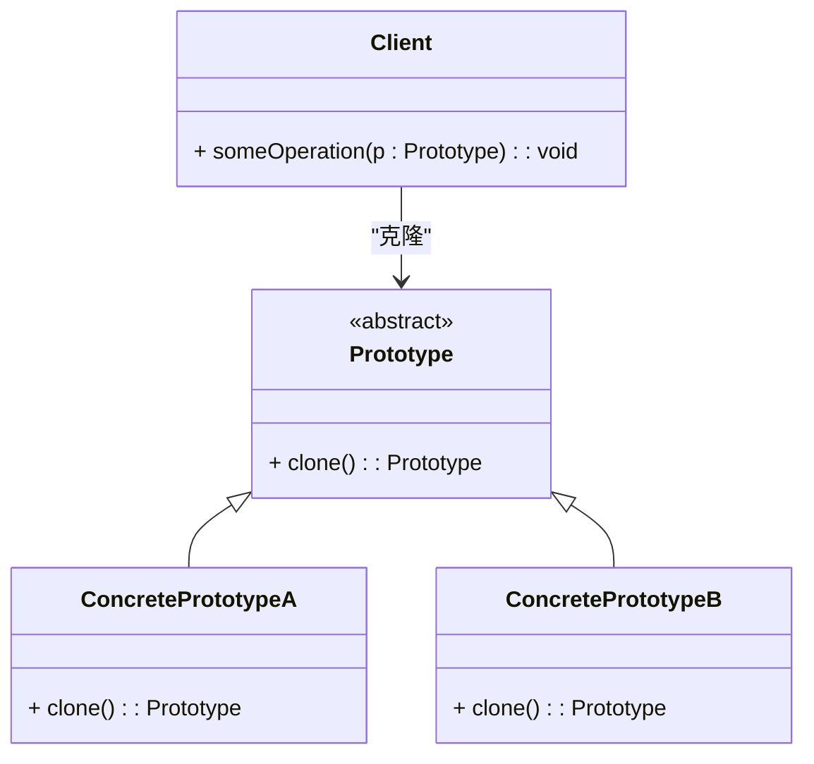

### 原型模式（Prototype）

原型模式是一种创建型设计模式，它允许通过复制现有的对象来创建新对象，而不是通过创建新的实例。原型模式主要用于那些创建成本较高或复杂的对象，可以通过复制现有对象来节省时间和资源。

#### 1. 原型模式的结构
原型模式包含以下几个主要组件：
- **Prototype（原型）**: 声明了复制自身的方法。
- **ConcretePrototype（具体原型）**: 实现了 `Prototype` 接口，并定义了复制自身的方法。
- **Client（客户端）**: 使用原型实例来创建新的对象，通常通过调用 `clone` 方法。

#### 2. Mermaid 关系图
以下是原型模式的类图，用 Mermaid 表示：



#### 3. 原型模式的实现

**Prototype 抽象原型类：**
```cpp
class Prototype {
public:
    virtual ~Prototype() = default;
    virtual Prototype* clone() const = 0;
};
```

**ConcretePrototypeA 具体原型A类：**
```cpp
class ConcretePrototypeA : public Prototype {
public:
    ConcretePrototypeA() {
        // 初始化代码
    }

    Prototype* clone() const override {
        return new ConcretePrototypeA(*this);
    }

    // 其他成员函数
};
```

**ConcretePrototypeB 具体原型B类：**
```cpp
class ConcretePrototypeB : public Prototype {
public:
    ConcretePrototypeB() {
        // 初始化代码
    }

    Prototype* clone() const override {
        return new ConcretePrototypeB(*this);
    }

    // 其他成员函数
};
```

**Client 客户端代码：**
```cpp
void ClientCode(const Prototype& prototype) {
    Prototype* clone = prototype.clone();
    // 使用克隆对象
    delete clone;
}

int main() {
    ConcretePrototypeA prototypeA;
    ClientCode(prototypeA);

    ConcretePrototypeB prototypeB;
    ClientCode(prototypeB);

    return 0;
}
```

#### 4. 使用原型模式
在客户端代码中，通过调用 `clone` 方法创建新对象而不是直接实例化对象。这样可以在运行时动态地创建对象，并且避免了对象创建的复杂性和开销。

#### 5. 总结
原型模式通过克隆现有对象来创建新对象，适用于对象创建成本较高的场景。Mermaid 类图展示了原型模式中的原型、具体原型以及客户端之间的关系，帮助理解模式的结构和实现。
