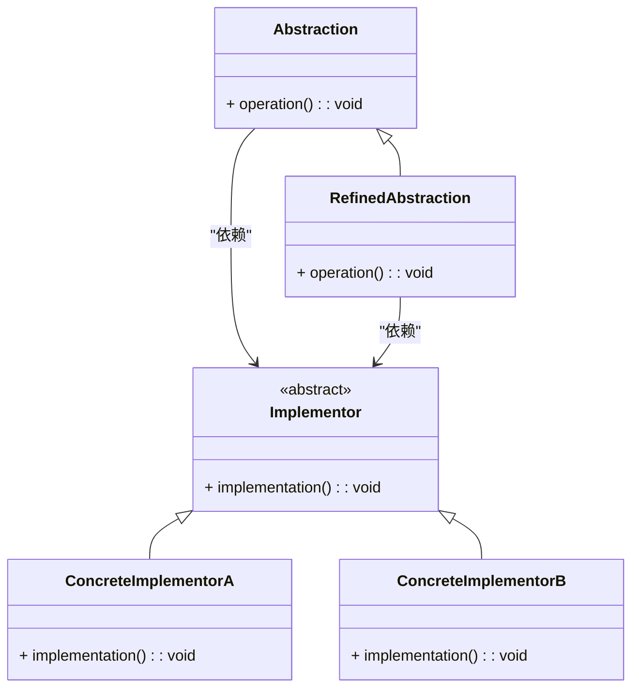

### 桥接模式（Bridge）

桥接模式是一种结构型设计模式，它通过将抽象部分与实现部分分离，使它们可以独立地变化。桥接模式的核心思想是将抽象部分与实现部分解耦，使得它们可以独立扩展而不影响彼此。

#### 1. 桥接模式的结构
桥接模式包含以下几个主要组件：
- **Abstraction（抽象类）**: 定义了抽象的接口，并且包含一个指向实现类的引用。
- **RefinedAbstraction（扩展抽象类）**: 扩展了抽象类的接口，通常增加了更多的功能。
- **Implementor（实现类接口）**: 定义了实现类的接口，这些接口与抽象类的接口分离。
- **ConcreteImplementor（具体实现类）**: 实现了 `Implementor` 接口，并提供了具体的实现。

#### 2. Mermaid 关系图
以下是桥接模式的类图，用 Mermaid 表示：



#### 3. 桥接模式的实现

**Implementor 实现类接口：**
```cpp
class Implementor {
public:
    virtual ~Implementor() = default;
    virtual void implementation() const = 0;
};
```

**ConcreteImplementorA 具体实现类A：**
```cpp
class ConcreteImplementorA : public Implementor {
public:
    void implementation() const override {
        std::cout << "ConcreteImplementorA implementation\n";
    }
};
```

**ConcreteImplementorB 具体实现类B：**
```cpp
class ConcreteImplementorB : public Implementor {
public:
    void implementation() const override {
        std::cout << "ConcreteImplementorB implementation\n";
    }
};
```

**Abstraction 抽象类：**
```cpp
class Abstraction {
protected:
    Implementor* implementor;

public:
    Abstraction(Implementor* imp) : implementor(imp) {}
    virtual ~Abstraction() = default;
    virtual void operation() const = 0;
};
```

**RefinedAbstraction 扩展抽象类：**
```cpp
class RefinedAbstraction : public Abstraction {
public:
    RefinedAbstraction(Implementor* imp) : Abstraction(imp) {}

    void operation() const override {
        std::cout << "RefinedAbstraction operation\n";
        implementor->implementation();
    }
};
```

#### 4. 使用桥接模式
在客户端代码中，通过将实现类与抽象类分开来灵活地选择不同的实现，并通过抽象类提供的接口进行操作。示例：

```cpp
int main() {
    Implementor* impA = new ConcreteImplementorA();
    Implementor* impB = new ConcreteImplementorB();

    Abstraction* absA = new RefinedAbstraction(impA);
    Abstraction* absB = new RefinedAbstraction(impB);

    absA->operation();
    absB->operation();

    delete absA;
    delete absB;
    delete impA;
    delete impB;
    return 0;
}
```

#### 5. 总结
桥接模式通过将抽象部分与实现部分分离，使得它们可以独立变化。这种模式特别适用于需要在多个维度上进行扩展的场景。Mermaid 类图展示了抽象类、扩展抽象类、实现类接口、具体实现类以及它们之间的关系，帮助理解模式的结构和实现。s