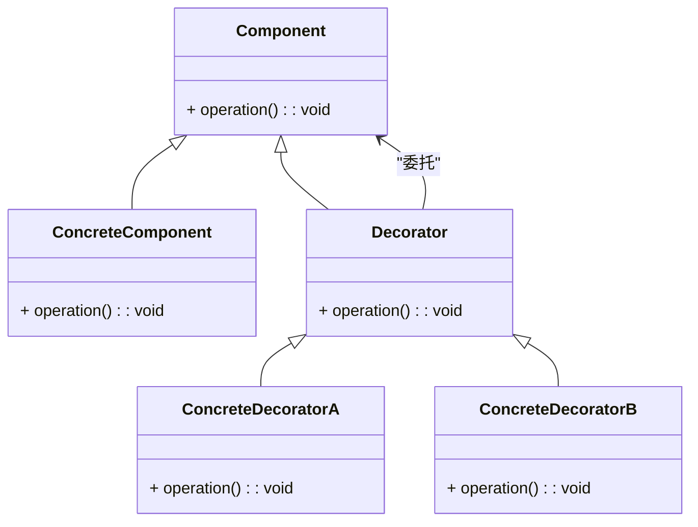

### 装饰器模式（Decorator）

装饰器模式是一种结构型设计模式，用于动态地给对象添加额外的功能。装饰器模式通过将功能附加到对象而不是继承来实现扩展，使得在运行时可以灵活地扩展对象的行为，而无需修改对象的代码。

#### 1. 装饰器模式的结构
装饰器模式包含以下几个主要组件：
- **Component（组件接口）**: 定义了一个对象接口，可以给这些对象添加额外的功能。
- **ConcreteComponent（具体组件）**: 实现了 `Component` 接口的实际对象。
- **Decorator（装饰器抽象类）**: 维护一个 `Component` 对象的引用，并实现了 `Component` 接口。它的目的是为具体装饰器提供一个基础。
- **ConcreteDecorator（具体装饰器）**: 扩展了 `Decorator` 类，增加了具体的功能。

#### 2. Mermaid 关系图
以下是装饰器模式的类图，用 Mermaid 表示：



#### 3. 装饰器模式的实现

**Component 组件接口：**
```cpp
class Component {
public:
    virtual ~Component() = default;
    virtual void operation() const = 0;
};
```

**ConcreteComponent 具体组件类：**
```cpp
class ConcreteComponent : public Component {
public:
    void operation() const override {
        std::cout << "ConcreteComponent operation\n";
    }
};
```

**Decorator 装饰器抽象类：**
```cpp
class Decorator : public Component {
protected:
    Component* component;

public:
    Decorator(Component* comp) : component(comp) {}
    virtual ~Decorator() = default;

    void operation() const override {
        component->operation();
    }
};
```

**ConcreteDecoratorA 具体装饰器A：**
```cpp
class ConcreteDecoratorA : public Decorator {
public:
    ConcreteDecoratorA(Component* comp) : Decorator(comp) {}

    void operation() const override {
        Decorator::operation();
        std::cout << "ConcreteDecoratorA additional operation\n";
    }
};
```

**ConcreteDecoratorB 具体装饰器B：**
```cpp
class ConcreteDecoratorB : public Decorator {
public:
    ConcreteDecoratorB(Component* comp) : Decorator(comp) {}

    void operation() const override {
        Decorator::operation();
        std::cout << "ConcreteDecoratorB additional operation\n";
    }
};
```

#### 4. 使用装饰器模式
在客户端代码中，通过组合多个装饰器来动态地给对象添加功能。示例：

```cpp
int main() {
    Component* simple = new ConcreteComponent();
    Component* decoratedA = new ConcreteDecoratorA(simple);
    Component* decoratedB = new ConcreteDecoratorB(decoratedA);

    decoratedB->operation();

    delete decoratedB;
    delete decoratedA;
    delete simple;
    return 0;
}
```

#### 5. 总结
装饰器模式通过将功能附加到对象而不是继承，使得在运行时可以灵活地扩展对象的行为。Mermaid 类图展示了组件、具体组件、装饰器抽象类、具体装饰器以及它们之间的关系，帮助理解模式的结构和实现。
