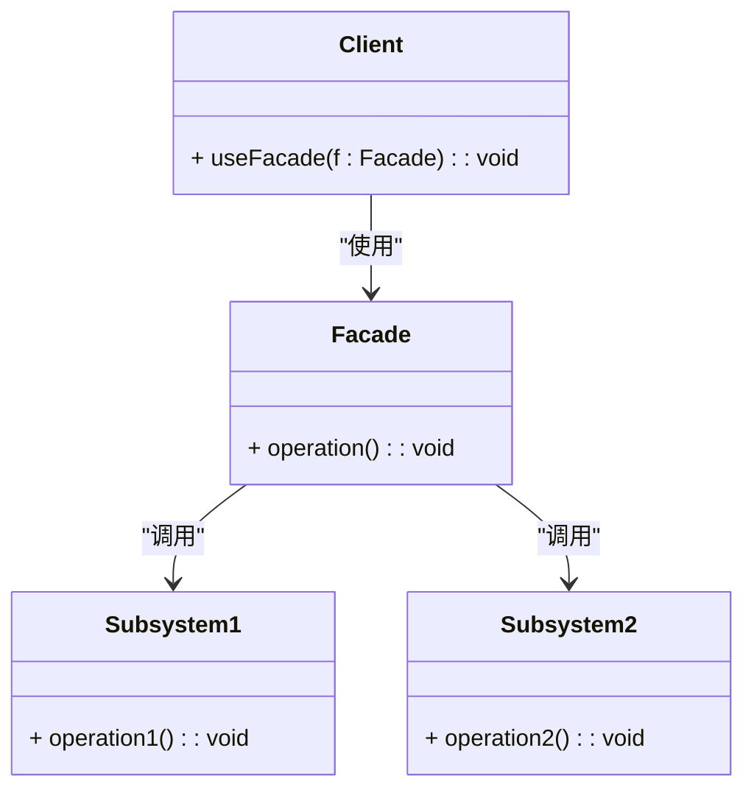

### 外观模式（Facade）

外观模式是一种结构型设计模式，用于简化复杂子系统的使用。它通过提供一个统一的接口来隐藏子系统的复杂性，使得客户端可以通过一个简洁的接口与子系统进行交互，而无需了解子系统的内部细节。

#### 1. 外观模式的结构
外观模式包含以下几个主要组件：
- **Facade（外观）**: 提供一个简化的接口来访问复杂子系统。它与多个子系统交互，并将子系统的复杂操作封装在自己的方法中。
- **Subsystem（子系统）**: 外观模式中的多个子系统，它们提供了具体的功能，但它们的使用可能比较复杂。
- **Client（客户端）**: 通过外观与子系统交互，客户端无需直接操作子系统。

#### 2. Mermaid 关系图
以下是外观模式的类图，用 Mermaid 表示：



#### 3. 外观模式的实现

**Subsystem1 子系统1：**
```cpp
class Subsystem1 {
public:
    void operation1() const {
        std::cout << "Subsystem1 operation1\n";
    }
};
```

**Subsystem2 子系统2：**
```cpp
class Subsystem2 {
public:
    void operation2() const {
        std::cout << "Subsystem2 operation2\n";
    }
};
```

**Facade 外观类：**
```cpp
class Facade {
private:
    Subsystem1 subsystem1;
    Subsystem2 subsystem2;

public:
    void operation() const {
        subsystem1.operation1();
        subsystem2.operation2();
    }
};
```

**Client 客户端代码：**
```cpp
void ClientCode(const Facade& facade) {
    facade.operation();
}

int main() {
    Facade* facade = new Facade();
    ClientCode(*facade);

    delete facade;
    return 0;
}
```

#### 4. 使用外观模式
在客户端代码中，通过调用外观类的方法来完成复杂的操作，而无需直接与子系统进行交互。外观类封装了子系统的复杂性，并提供了一个简单的接口给客户端。

#### 5. 总结
外观模式通过提供一个统一的接口来简化复杂子系统的使用，使得客户端可以更方便地使用系统中的功能，而无需了解内部的复杂性。Mermaid 类图展示了外观类、子系统以及客户端之间的关系，帮助理解模式的结构和实现。