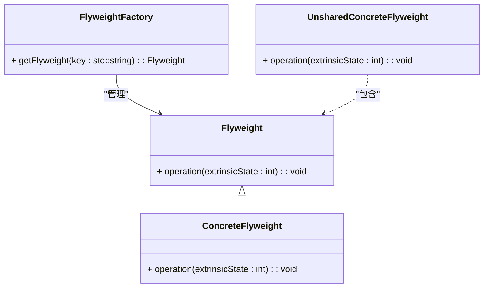

### 享元模式（Flyweight）

享元模式是一种结构型设计模式，用于减少创建大量小对象所带来的性能问题。它通过共享对象来支持大量的细粒度对象，从而减少内存消耗和提高性能。享元模式特别适用于大量相似对象的场景，例如在图形渲染、文本编辑器等应用中。

#### 1. 享元模式的结构
享元模式包含以下几个主要组件：
- **Flyweight（享元接口）**: 定义了具体享元对象所需的接口，用于支持共享的对象。
- **ConcreteFlyweight（具体享元）**: 实现了 `Flyweight` 接口，并且包含可以共享的状态。
- **UnsharedConcreteFlyweight（非共享的具体享元）**: 不参与共享的享元对象，它可能包含非共享的状态。
- **FlyweightFactory（享元工厂）**: 负责创建和管理享元对象，确保享元对象的共享。

#### 2. Mermaid 关系图
以下是享元模式的类图，用 Mermaid 表示：



#### 3. 享元模式的实现

**Flyweight 享元接口：**
```cpp
class Flyweight {
public:
    virtual ~Flyweight() = default;
    virtual void operation(int extrinsicState) const = 0;
};
```

**ConcreteFlyweight 具体享元类：**
```cpp
class ConcreteFlyweight : public Flyweight {
private:
    int intrinsicState;

public:
    ConcreteFlyweight(int state) : intrinsicState(state) {}

    void operation(int extrinsicState) const override {
        std::cout << "ConcreteFlyweight: intrinsicState = " << intrinsicState
                  << ", extrinsicState = " << extrinsicState << "\n";
    }
};
```

**UnsharedConcreteFlyweight 非共享的具体享元类：**
```cpp
class UnsharedConcreteFlyweight : public Flyweight {
public:
    void operation(int extrinsicState) const override {
        std::cout << "UnsharedConcreteFlyweight: extrinsicState = " << extrinsicState << "\n";
    }
};
```

**FlyweightFactory 享元工厂：**
```cpp
#include <map>
#include <memory>

class FlyweightFactory {
private:
    std::map<std::string, std::shared_ptr<Flyweight>> flyweights;

public:
    std::shared_ptr<Flyweight> getFlyweight(const std::string& key) {
        if (flyweights.find(key) == flyweights.end()) {
            flyweights[key] = std::make_shared<ConcreteFlyweight>(std::stoi(key));
        }
        return flyweights[key];
    }
};
```

**Client 客户端代码：**
```cpp
int main() {
    FlyweightFactory factory;

    std::shared_ptr<Flyweight> flyweight1 = factory.getFlyweight("1");
    std::shared_ptr<Flyweight> flyweight2 = factory.getFlyweight("2");
    std::shared_ptr<Flyweight> flyweight3 = factory.getFlyweight("1"); // Should reuse the same instance as flyweight1

    flyweight1->operation(10);
    flyweight2->operation(20);
    flyweight3->operation(30); // Should have the same intrinsic state as flyweight1

    return 0;
}
```

#### 4. 使用享元模式
在客户端代码中，通过享元工厂获取享元对象，享元工厂负责管理和共享享元对象。客户端可以使用这些享元对象，并通过它们来操作不同的外部状态。享元对象的共享机制有效减少了内存使用和对象创建开销。

#### 5. 总结
享元模式通过共享对象来支持大量的细粒度对象，减少内存消耗和提高性能。Mermaid 类图展示了享元接口、具体享元类、非共享的具体享元类、享元工厂以及它们之间的关系，帮助理解模式的结构和实现。